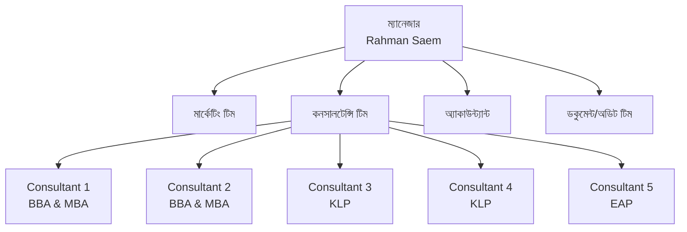

# অধ্যায় ৪: সাংগঠনিক কাঠামো ও বিভাগীয় দায়িত্ব

## ৪.১ উদ্দেশ্য (Purpose)

প্রতিটি কর্মী যেন জানেন — কে কার কাছে রিপোর্ট করেন, কোন বিভাগ কী কাজ করে এবং কোন সমস্যায় কার কাছে যেতে হবে।

## ৪.২ অর্গানোগ্রাম (Organogram)

> 📌 উপরের ডায়াগ্রামটি Mermaid ফরম্যাটে দেওয়া। DOCX-এ এটি টেক্সট/ছবি হিসেবে দেখানো হবে; নিচের টেবিলটি একই কাঠামো বর্ণনা করে।

## ৪.৩ পদ ও রিপোর্টিং লাইন

| পদ | রিপোর্ট করেন | মূল দায়িত্ব |
|---|---|---|
| ম্যানেজার (Rahman Saem) | ম্যানেজমেন্ট | সার্বিক তত্ত্বাবধান, KPI, এসকালেশন |
| মার্কেটিং টিম | ম্যানেজার | Facebook বিজ্ঞাপন, লিড জেনারেশন |
| Consultant 1 & 2 | ম্যানেজার | BBA & MBA লিড ও সেলস |
| Consultant 3 & 4 | ম্যানেজার | KLP লিড ও সেলস |
| Consultant 5 | ম্যানেজার | EAP লিড ও সেলস |
| অ্যাকাউন্ট্যান্ট | ম্যানেজার | পেমেন্ট যাচাই ও নিশ্চিতকরণ |
| ডকুমেন্ট/অডিট টিম | ম্যানেজার | ডকুমেন্ট সংগ্রহ ও অডিট (Manual 2) |

## ৪.৪ কনসালটেন্ট বরাদ্দ (Consultant Allocation)

| কনসালটেন্ট | দায়িত্বপ্রাপ্ত প্রোগ্রাম |
|---|---|
| Consultant 1 | BBA & MBA |
| Consultant 2 | BBA & MBA |
| Consultant 3 | KLP |
| Consultant 4 | KLP |
| Consultant 5 | EAP |

## ৪.৫ বিভাগীয় দায়িত্ব (Department Responsibilities)

**মার্কেটিং টিম:**
- Facebook বিজ্ঞাপন পরিচালনা
- পেজে আসা মেসেজে স্ক্রিপ্ট অনুযায়ী রিপ্লাই
- সঠিক প্রোগ্রামের Google Form পাঠানো
- লিড কোয়ালিটি নিশ্চিত করা

**কনসালটেন্সি টিম:**
- প্রতি ঘণ্টায় Google Sheet চেক
- নতুন লিডে সাথে সাথে কল
- সেলস পিচ ও অবজেকশন হ্যান্ডলিং
- WhatsApp ফলো-আপ ও পেমেন্ট কালেকশন

**অ্যাকাউন্ট্যান্ট:**
- পেমেন্ট (ক্যাশ/ব্যাংক/মোবাইল ব্যাংকিং/পোর্টাল) যাচাই
- পেমেন্ট নিশ্চিত হলে কনসালটেন্টকে জানানো

**ডকুমেন্ট/অডিট টিম:**
- ডকুমেন্ট সংগ্রহ, অডিট ও ইউনিভার্সিটি সাবমিশন (বিস্তারিত Manual 2-তে)

## ৪.৬ সাধারণ ভুল

- ⛔ ভুল প্রোগ্রামের কনসালটেন্টের কাছে লিড পাঠানো।
- ⛔ চেইন অব কমান্ড না মেনে সরাসরি ম্যানেজমেন্টে যাওয়া।

## ৪.৭ এসকালেশন

সমস্যা → প্রথমে সংশ্লিষ্ট টিম লিড → এরপর **ম্যানেজার (Rahman Saem)** → এরপর ম্যানেজমেন্ট।

## ৪.৮ ট্রেনিং অনুশীলন

> অর্গানোগ্রামটি না দেখে স্মৃতি থেকে এঁকে দেখান — কোন কনসালটেন্ট কোন প্রোগ্রামে কাজ করেন লিখুন।

## ৪.৯ ম্যানেজার চেকলিস্ট

- [ ] প্রতিটি প্রোগ্রামে কনসালটেন্ট বরাদ্দ সঠিক?
- [ ] রিপোর্টিং লাইন সবাই বোঝে?

\newpage
