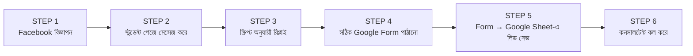

# অধ্যায় ৫: মার্কেটিং ওয়ার্কফ্লো

## ৫.১ উদ্দেশ্য (Purpose)

Facebook বিজ্ঞাপনের মাধ্যমে মানসম্পন্ন লিড তৈরি করা এবং প্রতিটি আগ্রহী শিক্ষার্থীকে দ্রুত সঠিক প্রোগ্রামের Google Form-এ পৌঁছে দেওয়া।

## ৫.২ দায়িত্ব (Responsibilities)

- Facebook বিজ্ঞাপন তৈরি, পরিচালনা ও অপ্টিমাইজ করা।
- পেজ ইনবক্সে আসা মেসেজে **নির্ধারিত স্ক্রিপ্ট** অনুযায়ী দ্রুত রিপ্লাই।
- শিক্ষার্থীর আগ্রহ বুঝে সঠিক প্রোগ্রামের Google Form পাঠানো।
- লিড কোয়ালিটি ও রেসপন্স টাইম মনিটর করা।

## ৫.৩ ধাপে ধাপে ওয়ার্কফ্লো (Step-by-Step)

**STEP 1 — বিজ্ঞাপন:** মার্কেটিং টিম Facebook-এ KLP/EAP/Bachelor/Master/PhD প্রোগ্রামের বিজ্ঞাপন চালায়।

**STEP 2 — মেসেজ:** আগ্রহী শিক্ষার্থী Facebook পেজে মেসেজ করে।

**STEP 3 — রিপ্লাই:** মার্কেটিং একটি **predefined script** দিয়ে রিপ্লাই করে (দেখুন §৫.৫)।

**STEP 4 — Form পাঠানো:** শিক্ষার্থীর আগ্রহী প্রোগ্রাম অনুযায়ী সঠিক Google Form লিংক পাঠানো হয়।

**STEP 5 — অটো-সেভ:** Google Form স্বয়ংক্রিয়ভাবে প্রতিটি লিড Google Sheet-এ সংরক্ষণ করে।

**STEP 6 — হ্যান্ডওভার:** লিড এখন কনসালটেন্টের কাছে চলে যায় (অধ্যায় ৮–১০)।

## ৫.৪ Google Form নির্বাচন (প্রোগ্রাম অনুযায়ী)

| শিক্ষার্থীর আগ্রহ | পাঠাতে হবে |
|---|---|
| কোরিয়ান ভাষা | KLP Form |
| ইংরেজি/একাডেমিক পাথওয়ে | EAP Form |
| স্নাতক (BBA) | Bachelor's Form |
| স্নাতকোত্তর (MBA) | Master's Form |
| পিএইচডি/গবেষণা | PhD Form |

## ৫.৫ নির্ধারিত রিপ্লাই স্ক্রিপ্ট (Predefined Script)

> আসসালামু আলাইকুম / নমস্কার। **Hangeul Korean Language & Visa**-তে আপনাকে স্বাগতম। 🇰🇷
> কোরিয়ায় পড়াশোনার ব্যাপারে আগ্রহ প্রকাশের জন্য ধন্যবাদ।
> আপনি কোন প্রোগ্রামে আগ্রহী — **কোরিয়ান ভাষা (KLP), EAP, ব্যাচেলর, মাস্টার্স নাকি পিএইচডি**?
> সঠিক তথ্য দিতে অনুগ্রহ করে নিচের ছোট ফর্মটি পূরণ করুন 👉 [Google Form Link]
> ফর্ম পূরণের পর আমাদের একজন কনসালটেন্ট খুব শীঘ্রই আপনাকে কল করবেন। ধন্যবাদ। 🙏

[PLACEHOLDER - Facebook Page Inbox Screenshot]

## ৫.৬ চেকলিস্ট

- [ ] বিজ্ঞাপন সক্রিয় ও বাজেট ঠিক আছে
- [ ] নতুন মেসেজে ৫ মিনিটের মধ্যে রিপ্লাই
- [ ] সঠিক প্রোগ্রামের Form পাঠানো হয়েছে
- [ ] শিক্ষার্থীকে "কনসালটেন্ট কল করবে" জানানো হয়েছে

## ৫.৭ সাধারণ ভুল

- ⛔ ভুল প্রোগ্রামের Form পাঠানো।
- ⛔ মেসেজের রিপ্লাই দিতে দেরি করা (লিড ঠান্ডা হয়ে যায়)।
- ⛔ স্ক্রিপ্ট বাদ দিয়ে এলোমেলো উত্তর।

## ৫.৮ বেস্ট প্র্যাকটিস

- ✅ প্রতিটি রিপ্লাইয়ে ব্র্যান্ড নাম ও ইমোজি ব্যবহার করে বন্ধুত্বপূর্ণ টোন।
- ✅ Form লিংক পাঠানোর পর ফলো-আপ মেসেজ ("ফর্ম পূরণ হলে জানাবেন")।

## ৫.৯ এসকালেশন

বিজ্ঞাপন বন্ধ/পেমেন্ট সমস্যা/লিড কমে যাওয়া → **ম্যানেজার (Rahman Saem)**।

## ৫.১০ FAQ

**প্রশ্ন:** শিক্ষার্থী প্রোগ্রাম না বলে দাম জানতে চাইলে?
**উত্তর:** প্রথমে প্রোগ্রাম নিশ্চিত করুন, তারপর Form পাঠান — বিস্তারিত কনসালটেন্ট কলে জানাবেন।

## ৫.১১ ট্রেনিং অনুশীলন

> একটি নমুনা Facebook মেসেজের জন্য সম্পূর্ণ রিপ্লাই + সঠিক Form নির্বাচন করে দেখান।

## ৫.১২ ম্যানেজার চেকলিস্ট

- [ ] গড় রেসপন্স টাইম < ৫ মিনিট?
- [ ] সঠিক Form সিলেকশন রেট ভালো?
- [ ] দৈনিক লিড সংখ্যা টার্গেটের মধ্যে?

\newpage
