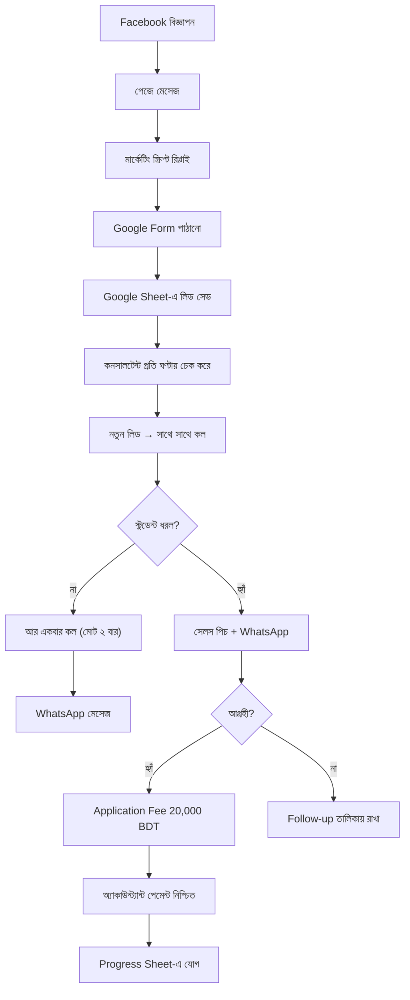

# অধ্যায় ৬: লিড ফ্লো (Lead Flow)

## ৬.১ উদ্দেশ্য

একটি লিড কোথা থেকে আসে এবং কীভাবে কনভার্সন পর্যন্ত পৌঁছায় — সম্পূর্ণ জীবনচক্র বোঝা।

## ৬.২ সম্পূর্ণ লিড লাইফসাইকেল

## ৬.৩ লিড স্ট্যাটাস (Lead Status) সংজ্ঞা

| স্ট্যাটাস | অর্থ |
|---|---|
| **New** | Form পূরণ হয়েছে, এখনো কল হয়নি |
| **Contacted** | প্রথম কল হয়েছে, স্টুডেন্ট ধরেছে |
| **No Answer (1)** | প্রথম কলে ধরেনি |
| **No Answer (2)** | দ্বিতীয় কলেও ধরেনি — আর কল নয় |
| **Interested** | আগ্রহী, ফলো-আপ চলছে |
| **Fee Paid** | Application Fee (20,000 BDT) পরিশোধিত |
| **Confirmed** | অ্যাকাউন্ট্যান্ট নিশ্চিত → Progress Sheet-এ যোগ |
| **Not Interested** | আগ্রহী নয় (কারণসহ Remarks) |

## ৬.৪ SLA (Service Level Agreement)

| কাজ | সময়সীমা |
|---|---|
| নতুন লিড → প্রথম কল | **সর্বোচ্চ ১ ঘণ্টা** |
| কল না ধরলে দ্বিতীয় কল | একই দিনে |
| প্রতিটি কলের পর WhatsApp | সাথে সাথে |
| Remarks আপডেট | কল শেষ হওয়ার সাথে সাথে |

> ⏱️ **সোনালি নিয়ম:** কোনো লিড এক ঘণ্টার বেশি অপেক্ষা করবে না।

## ৬.৫ চেকলিস্ট

- [ ] প্রতিটি নতুন লিড ১ ঘণ্টার মধ্যে কল হয়েছে
- [ ] স্ট্যাটাস সঠিকভাবে আপডেট
- [ ] কল না ধরলে সর্বোচ্চ ২ বার কল
- [ ] প্রতিটি কলের পর WhatsApp

## ৬.৬ সাধারণ ভুল

- ⛔ লিড দেখেও দেরি করা।
- ⛔ ২ বারের বেশি কল করে স্টুডেন্টকে বিরক্ত করা।
- ⛔ স্ট্যাটাস আপডেট না করা → ডুপ্লিকেট কল।

## ৬.৭ বেস্ট প্র্যাকটিস

- ✅ প্রতিটি লিডে সময় ও ফলাফল Remarks-এ নোট করুন।
- ✅ "Interested" লিডের জন্য পরবর্তী ফলো-আপ তারিখ সেট করুন।

## ৬.৮ এসকালেশন

লিড ফ্লোতে বাধা (Form কাজ করছে না, Sheet আপডেট হচ্ছে না) → **ম্যানেজার**।

## ৬.৯ FAQ

**প্রশ্ন:** একই স্টুডেন্ট দুইবার Form পূরণ করলে?
**উত্তর:** Remarks-এ ডুপ্লিকেট চিহ্নিত করুন, একজনই কল করবেন।

## ৬.১০ ট্রেনিং অনুশীলন

> একটি নমুনা লিডের জন্য New থেকে Confirmed পর্যন্ত সব স্ট্যাটাস ধাপ লিখে দেখান।

## ৬.১১ ম্যানেজার চেকলিস্ট

- [ ] গড় প্রথম-কল টাইম ১ ঘণ্টার নিচে?
- [ ] কোনো লিড "New" অবস্থায় আটকে নেই?
- [ ] কনভার্সন ফানেল স্বাস্থ্যকর?

\newpage
