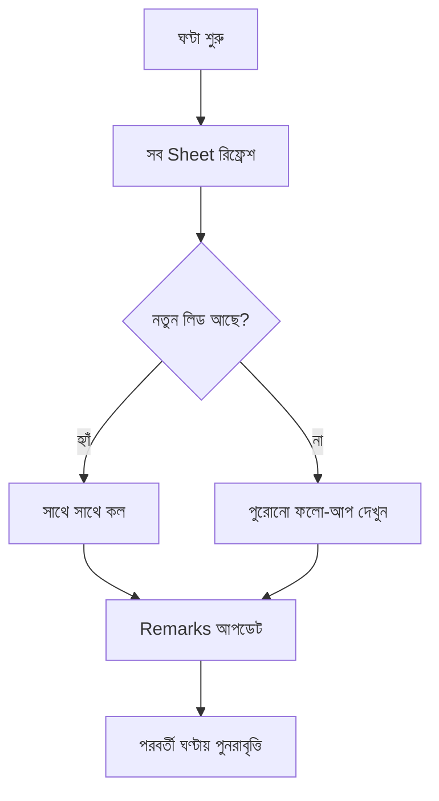

# অধ্যায় ৯: প্রতি ঘণ্টার লিড চেকিং SOP

## ৯.১ উদ্দেশ্য

নিশ্চিত করা যে প্রতিটি নতুন লিড **সর্বোচ্চ ১ ঘণ্টার মধ্যে** কল পায় — কোনো লিড যেন ঠান্ডা না হয়।

## ৯.২ মূল নিয়ম

> ⏰ **প্রতি ১ ঘণ্টা পর পর** প্রতিটি কনসালটেন্ট তার সব নির্ধারিত Google Sheet চেক করবেন।
> নতুন লিড দেখামাত্র **সাথে সাথে কল** করবেন।
> **কোনো লিড ১ ঘণ্টার বেশি অপেক্ষা করবে না।**

## ৯.৩ দৈনিক হাউলি টাইমলাইন (৯টা–৬টা)

| সময় | কাজ |
|---|---|
| ৯:০০ | সব Sheet খুলুন → রাতের/সকালের নতুন লিড কল |
| ১০:০০ | নতুন লিড চেক ও কল |
| ১১:০০ | নতুন লিড চেক ও কল |
| ১২:০০ | নতুন লিড চেক ও কল |
| ১:০০ | নতুন লিড চেক (লাঞ্চের আগে) |
| ২:০০ | নতুন লিড চেক ও কল |
| ৩:০০ | নতুন লিড চেক ও কল |
| ৪:০০ | নতুন লিড চেক ও কল |
| ৫:০০ | নতুন লিড চেক ও কল |
| ৫:৪৫ | দিনের শেষ চেক + ফলো-আপ আপডেট |

## ৯.৪ ধাপে ধাপে

## ৯.৫ চেকলিস্ট (প্রতি ঘণ্টা)

- [ ] সব Sheet রিফ্রেশ করেছি
- [ ] নতুন লিড চিহ্নিত ও কল করেছি
- [ ] কোনো লিড ১ ঘণ্টার বেশি অপেক্ষা করেনি
- [ ] Remarks আপডেট করেছি

## ৯.৬ সাধারণ ভুল

- ⛔ ঘণ্টা মিস করা → লিড ২-৩ ঘণ্টা অপেক্ষা।
- ⛔ শুধু সকালে একবার চেক করা।
- ⛔ কল না করেই "পরে করব" ভাবা।

## ৯.৭ বেস্ট প্র্যাকটিস

- ✅ ফোন/কম্পিউটারে প্রতি ঘণ্টার অ্যালার্ম সেট করুন।
- ✅ লাঞ্চ/ব্রেকের সময় সহকর্মীর সাথে কভারেজ ভাগ করুন।

## ৯.৮ এসকালেশন

লিড সংখ্যা এত বেশি যে ১ ঘণ্টায় কভার সম্ভব নয় → **ম্যানেজার**-কে জানান (অতিরিক্ত সাপোর্ট বরাদ্দ)।

## ৯.৯ FAQ

**প্রশ্ন:** মিটিং/ট্রেনিংয়ে থাকলে ঘণ্টা মিস হলে?
**উত্তর:** ফিরে এসে অগ্রাধিকার ভিত্তিতে পুরোনো নতুন লিডগুলো আগে কল করুন।

## ৯.১০ ট্রেনিং অনুশীলন

> আপনার ফোনে প্রতি ঘণ্টার একটি রিমাইন্ডার সেট করুন এবং একদিন অনুসরণ করে রিপোর্ট দিন।

## ৯.১১ ম্যানেজার চেকলিস্ট

- [ ] প্রতি ঘণ্টায় লিড চেক হচ্ছে?
- [ ] গড় ওয়েট টাইম < ১ ঘণ্টা?
- [ ] পিক আওয়ারে পর্যাপ্ত কভারেজ?

\newpage
