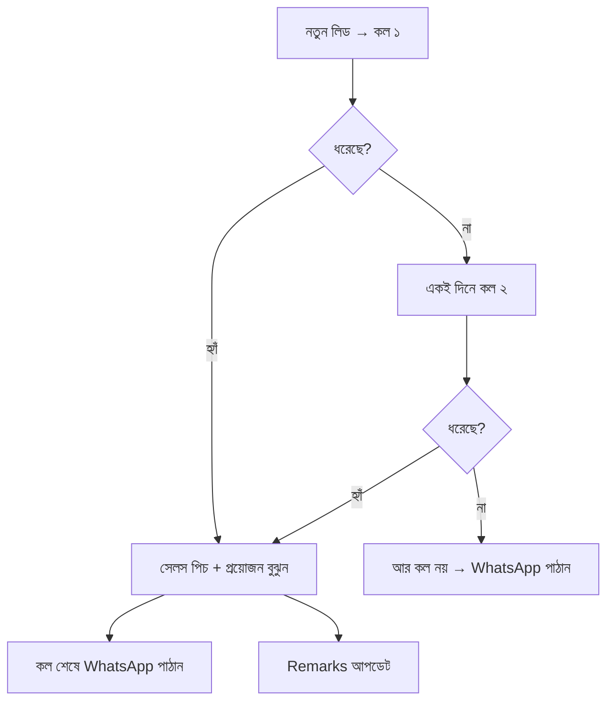

# অধ্যায় ১০: ফোন কল SOP

## ১০.১ উদ্দেশ্য

প্রতিটি কল যেন পেশাদার, বন্ধুত্বপূর্ণ ও ফলপ্রসূ হয় এবং নিয়ম অনুযায়ী (সর্বোচ্চ ২ কল + প্রতি কলের পর WhatsApp) পরিচালিত হয়।

## ১০.২ মূল নিয়ম

> 📞 নতুন লিড এলে **সাথে সাথে কল**।
> স্টুডেন্ট **না ধরলে → আর মাত্র একবার কল** (মোট ২ বার)। এরপর আর কল নয়।
> **প্রতিটি ফোন কথোপকথনের পর একটি WhatsApp মেসেজ পাঠাতে হবে।**

## ১০.৩ কল ফ্লো (Decision Tree)

## ১০.৪ ধাপে ধাপে একটি আদর্শ কল

1. **প্রস্তুতি:** লিডের নাম, প্রোগ্রাম, জেলা দেখে নিন।
2. **সালাম/সম্ভাষণ:** "আসসালামু আলাইকুম, আমি [নাম] বলছি Hangeul Korean Language & Visa থেকে।"
3. **যাচাই:** "আপনি কি [প্রোগ্রাম] নিয়ে আগ্রহ প্রকাশ করেছিলেন?"
4. **প্রয়োজন বোঝা:** কেন কোরিয়া, কোন ইনটেক, বাজেট, ভাষা স্তর।
5. **পিচ:** প্রোগ্রাম অনুযায়ী সেলস পিচ (অধ্যায় ১৩–১৭)।
6. **অবজেকশন হ্যান্ডলিং:** (অধ্যায় ১৮–১৯)।
7. **পরবর্তী ধাপ:** Application Fee ও ডকুমেন্ট সম্পর্কে জানান।
8. **সমাপ্তি:** ধন্যবাদ + "আমি এখনই WhatsApp-এ সব তথ্য পাঠাচ্ছি।"
9. **কল শেষে:** WhatsApp মেসেজ + Remarks আপডেট।

## ১০.৫ কল শিষ্টাচার (Etiquette)

- সবসময় "আপনি" সম্বোধন।
- ধীরে, স্পষ্ট ও আত্মবিশ্বাসের সাথে কথা বলুন।
- স্টুডেন্টের কথা মন দিয়ে শুনুন, মাঝে বাধা দেবেন না।
- মিথ্যা প্রতিশ্রুতি বা গ্যারান্টি দেবেন না।

## ১০.৬ চেকলিস্ট (প্রতি কল)

- [ ] নিজের নাম ও প্রতিষ্ঠান বলেছি
- [ ] প্রোগ্রাম যাচাই করেছি
- [ ] প্রয়োজন বুঝে পিচ দিয়েছি
- [ ] পরবর্তী ধাপ পরিষ্কার করেছি
- [ ] কল শেষে WhatsApp পাঠিয়েছি
- [ ] Remarks আপডেট করেছি

## ১০.৭ সাধারণ ভুল

- ⛔ ২ বারের বেশি কল করে বিরক্ত করা।
- ⛔ কল শেষে WhatsApp না পাঠানো।
- ⛔ মিথ্যা গ্যারান্টি (ভিসা নিশ্চিত ইত্যাদি)।
- ⛔ অপেশাদার বা তাড়াহুড়ো টোন।

## ১০.৮ বেস্ট প্র্যাকটিস

- ✅ হাসিমুখে কথা বলুন (কণ্ঠে বোঝা যায়)।
- ✅ স্টুডেন্টের নাম ধরে ডাকুন।
- ✅ কল শেষে ধন্যবাদ ও পরবর্তী ধাপ পরিষ্কার করুন।

## ১০.৯ এসকালেশন

স্টুডেন্ট আক্রমণাত্মক/জটিল প্রশ্ন/আইনি বিষয় → **ম্যানেজার**-এর কাছে হস্তান্তর।

## ১০.১০ FAQ

**প্রশ্ন:** স্টুডেন্ট ব্যস্ত থাকলে?
**উত্তর:** সুবিধাজনক সময় জিজ্ঞেস করে সেই সময়ে কল দিন এবং Remarks-এ নোট করুন।

**প্রশ্ন:** নম্বর বন্ধ থাকলে?
**উত্তর:** No Answer(1)/(2) হিসেবে গণ্য করুন এবং WhatsApp পাঠান।

## ১০.১১ ট্রেনিং অনুশীলন

> একজন সহকর্মীর সাথে একটি মক কল করুন — সম্ভাষণ থেকে WhatsApp পর্যন্ত সব ধাপ অনুসরণ করে।

## ১০.১২ ম্যানেজার চেকলিস্ট

- [ ] কল কোয়ালিটি স্ট্যান্ডার্ড মানা হচ্ছে?
- [ ] ২-কল নিয়ম মানা হচ্ছে?
- [ ] প্রতি কলের পর WhatsApp যাচ্ছে?

\newpage
