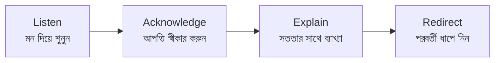

# অধ্যায় ১৮: সম্পূর্ণ অবজেকশন হ্যান্ডলিং

## ১৮.১ উদ্দেশ্য

শিক্ষার্থীর আপত্তি (objection) পেশাদারভাবে, সততার সাথে সামলে আস্থা তৈরি করা এবং সিদ্ধান্তে সহায়তা করা।

## ১৮.২ অবজেকশন হ্যান্ডলিং নীতি (LAER)

## ১৮.৩ সাধারণ অবজেকশন ও উত্তর

| আপত্তি | পেশাদার উত্তর |
|---|---|
| "খরচ বেশি" | "বুঝতে পারছি। এটি একটি বিনিয়োগ — আন্তর্জাতিক ডিগ্রি ও ক্যারিয়ার। খরচ ধাপে ভাগ হয়; আমি বিস্তারিত ব্রেকডাউন পাঠাচ্ছি।" |
| "Application Fee কেন?" | "এই ২০,০০০ টাকা দিয়ে আমরা আপনার ফাইল প্রফেশনালি প্রসেস শুরু করি। এটি নন-রিফান্ডেবল কারণ কাজ তখনই শুরু হয়।" |
| "ভিসা কি নিশ্চিত?" | "কোনো সৎ প্রতিষ্ঠান ভিসা গ্যারান্টি দিতে পারে না। তবে আমরা ডকুমেন্ট নির্ভুল করে সর্বোচ্চ সম্ভাবনা নিশ্চিত করি।" |
| "আমি ভেবে জানাব" | "অবশ্যই। আমি WhatsApp-এ সব তথ্য পাঠাচ্ছি; কাল এই সময়ে একটু ফলো-আপ করি?" |
| "অন্য এজেন্সি সস্তা" | "দাম নয়, স্বচ্ছতা ও নির্ভুল ডকুমেন্টই আসল — এখানেই আমরা এগিয়ে।" |
| "কোরিয়ান ভাষা কঠিন" | "শুরুতে সবার জন্যই নতুন; KLP ঠিক এই কারণেই — ধাপে ধাপে শেখায়।" |
| "কাজ করে খরচ তুলতে পারব?" | "নিয়ম মেনে সীমিত খণ্ডকালীন কাজ সম্ভব, তবে এটি আয়ের গ্যারান্টি নয়।" |

## ১৮.৪ যা কখনো বলবেন না (Red Lines)

- ⛔ "ভিসা ১০০% হবে।"
- ⛔ "মাসে এত টাকা কামাবেন।"
- ⛔ "নকল/ম্যানেজ করা ডকুমেন্ট চলবে।"
- ⛔ অন্য এজেন্সি সম্পর্কে মিথ্যা/অবমাননাকর কথা।

## ১৮.৫ চেকলিস্ট

- [ ] আপত্তি মন দিয়ে শুনেছি
- [ ] স্বীকার করেছি (তর্ক নয়)
- [ ] সৎ ব্যাখ্যা দিয়েছি
- [ ] পরবর্তী ধাপে নিয়েছি

## ১৮.৬ সাধারণ ভুল

- ⛔ স্টুডেন্টের সাথে তর্ক করা।
- ⛔ চাপ দিয়ে বিক্রির চেষ্টা।
- ⛔ মিথ্যা আশ্বাস।

## ১৮.৭ বেস্ট প্র্যাকটিস

- ✅ সহানুভূতি দেখান, তারপর তথ্য দিন।
- ✅ প্রতিটি আপত্তির পর একটি প্রশ্ন করে সংলাপ চালু রাখুন।

## ১৮.৮ এসকালেশন / FAQ / অনুশীলন / ম্যানেজার চেকলিস্ট

- **এসকালেশন:** আইনি/আর্থিক জটিল আপত্তি → ম্যানেজার।
- **FAQ:** "স্টুডেন্ট রেগে গেলে?" → শান্ত থাকুন, শুনুন, প্রয়োজনে ম্যানেজারে হস্তান্তর।
- **অনুশীলন:** উপরের ৫টি আপত্তির রোলপ্লে করুন।
- **ম্যানেজার চেকলিস্ট:** [ ] Red Lines মানা হচ্ছে? [ ] অবজেকশন রেসপন্স মানসম্মত?

\newpage
