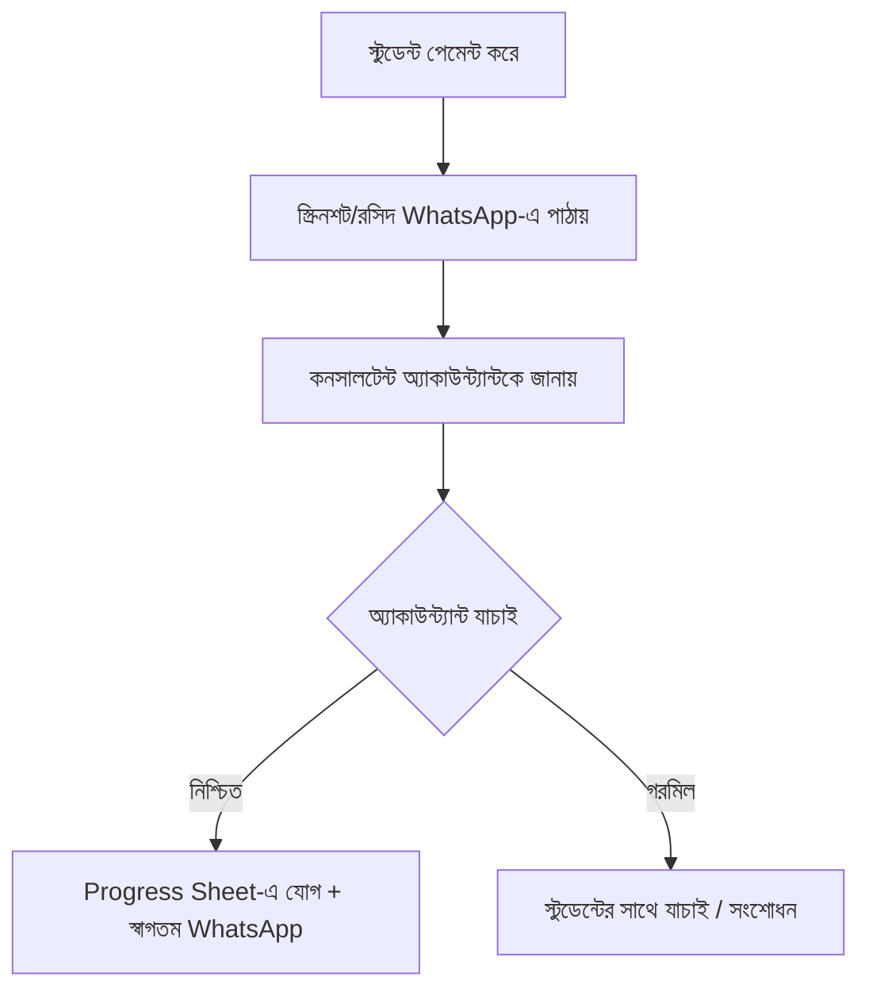

# অধ্যায় ২০: পেমেন্ট কালেকশন ও Application Fee SOP

## ২০.১ উদ্দেশ্য

Application Fee সঠিকভাবে সংগ্রহ, যাচাই ও নথিভুক্ত করা এবং শুধুমাত্র অ্যাকাউন্ট্যান্টের নিশ্চিতকরণের পরই শিক্ষার্থীকে Progress Sheet-এ যোগ করা।

## ২০.২ Application Fee নীতি

| বিষয় | তথ্য |
|---|---|
| পরিমাণ | **২০,০০০ টাকা (BDT)** |
| ধরন | **নন-রিফান্ডেবল (Non-refundable)** |
| কখন | সেলস কনফার্মেশনের পর, প্রসেসিং শুরুর আগে |
| নিশ্চিতকরণ | **অ্যাকাউন্ট্যান্ট** যাচাই করার পর |
| পরবর্তী ধাপ | তবেই Progress Sheet-এ যোগ |

> 💰 **মূল নিয়ম:** অ্যাকাউন্ট্যান্ট পেমেন্ট নিশ্চিত না করা পর্যন্ত কোনো শিক্ষার্থীকে Progress Sheet-এ যোগ করা যাবে না।

## ২০.৩ পেমেন্ট মাধ্যম (Payment Methods)

| মাধ্যম | বিবরণ | প্রমাণ |
|---|---|---|
| ক্যাশ (Cash) | অফিসে সরাসরি | রসিদ |
| ব্যাংক ট্রান্সফার (Bank Transfer) | ব্যাংক অ্যাকাউন্টে | ব্যাংক স্লিপ/স্ক্রিনশট |
| মোবাইল ব্যাংকিং (Mobile Banking) | bKash/Nagad/Rocket | ট্রান্সঅ্যাকশন স্ক্রিনশট |
| পোর্টাল আপলোড (Portal Upload) | নির্ধারিত পোর্টালে | আপলোড কনফার্মেশন |

[PLACEHOLDER - Payment Screenshot]
[PLACEHOLDER - Bank/bKash Account Details]

## ২০.৪ পেমেন্ট ভেরিফিকেশন ওয়ার্কফ্লো

## ২০.৫ ধাপে ধাপে

1. সেলস কনফার্ম হলে স্টুডেন্টকে পেমেন্ট মাধ্যম ও তথ্য দিন (WhatsApp T4)।
2. স্টুডেন্ট পেমেন্ট করে স্ক্রিনশট/রসিদ পাঠায়।
3. কনসালটেন্ট তথ্যসহ **অ্যাকাউন্ট্যান্ট**-কে জানায়।
4. অ্যাকাউন্ট্যান্ট যাচাই করে **নিশ্চিত** করেন।
5. নিশ্চিত হলে → Progress Sheet-এ যোগ (অধ্যায় ২৪) + স্বাগতম মেসেজ (T6)।
6. Incentive: প্রতিটি সফল কনভার্সনে কনসালটেন্ট **৫০০ টাকা** (অধ্যায় ২৭)।

## ২০.৬ চেকলিস্ট

- [ ] সঠিক পেমেন্ট তথ্য দিয়েছি
- [ ] স্ক্রিনশট/রসিদ সংগ্রহ করেছি
- [ ] অ্যাকাউন্ট্যান্টকে জানিয়েছি
- [ ] নিশ্চিতকরণের পরই Progress Sheet আপডেট
- [ ] স্বাগতম মেসেজ পাঠিয়েছি

## ২০.৭ সাধারণ ভুল

- ⛔ যাচাই ছাড়াই Progress Sheet-এ যোগ।
- ⛔ ভুয়া/সম্পাদিত স্ক্রিনশট গ্রহণ।
- ⛔ Fee "রিফান্ডেবল" বলা।
- ⛔ ব্যক্তিগত অ্যাকাউন্টে টাকা নেওয়া (কঠোর নিষিদ্ধ)।

## ২০.৮ বেস্ট প্র্যাকটিস

- ✅ সবসময় অফিসিয়াল অ্যাকাউন্ট/নম্বরে পেমেন্ট।
- ✅ ট্রান্সঅ্যাকশন আইডি Remarks-এ নোট করুন।

## ২০.৯ এসকালেশন

পেমেন্ট গরমিল/জালিয়াতির সন্দেহ → সাথে সাথে **অ্যাকাউন্ট্যান্ট + ম্যানেজার**।

## ২০.১০ FAQ

**প্রশ্ন:** স্টুডেন্ট কিস্তিতে দিতে চাইলে?
**উত্তর:** নীতি অনুযায়ী ম্যানেজারের অনুমোদন লাগবে; নিজে সিদ্ধান্ত নেবেন না।

## ২০.১১ ট্রেনিং অনুশীলন

> একটি নমুনা পেমেন্টের পুরো ভেরিফিকেশন ফ্লো লিখে দেখান — স্ক্রিনশট থেকে Progress Sheet পর্যন্ত।

## ২০.১২ ম্যানেজার চেকলিস্ট

- [ ] প্রতিটি Progress Sheet এন্ট্রির পেছনে অ্যাকাউন্ট্যান্ট নিশ্চিতকরণ আছে?
- [ ] কোনো যাচাই-বহির্ভূত পেমেন্ট নেই?

\newpage
