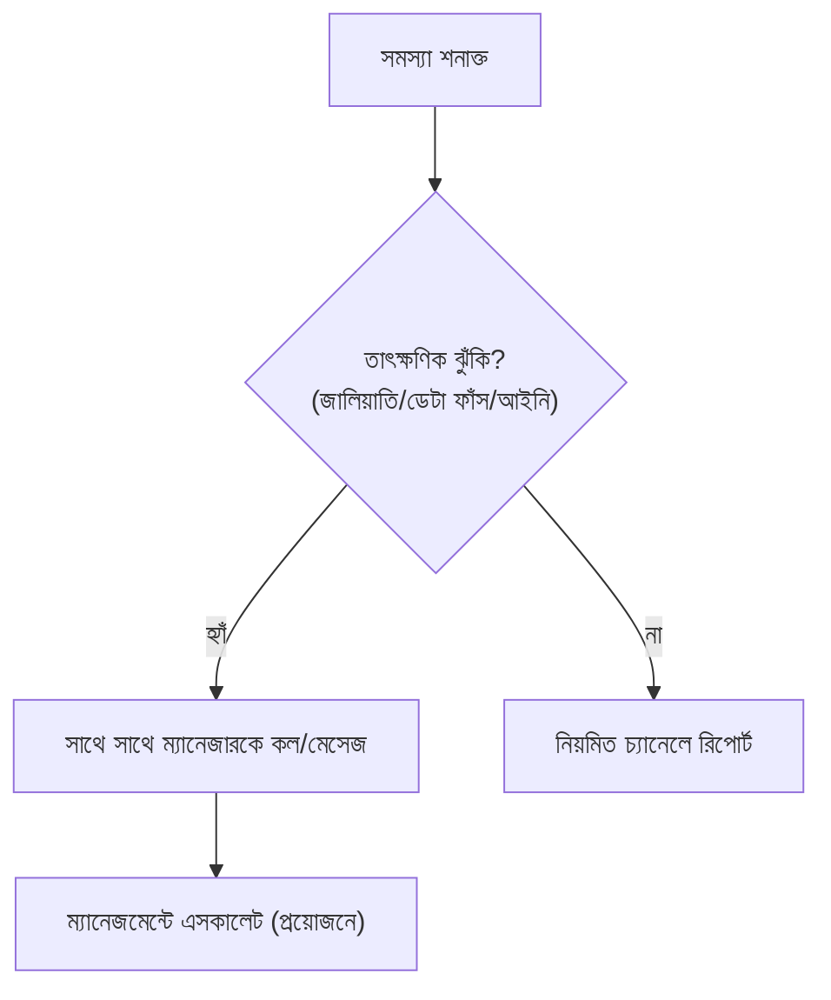

# অধ্যায় ২৯: ম্যানেজার দায়িত্ব ও জরুরি এসকালেশন

## ২৯.১ উদ্দেশ্য

ম্যানেজারের (Rahman Saem) ভূমিকা, দৈনন্দিন তত্ত্বাবধান এবং জরুরি পরিস্থিতিতে এসকালেশন পথ নির্ধারণ করা।

## ২৯.২ ম্যানেজার দায়িত্ব (Manager Responsibilities)

1. দৈনিক লিড ফ্লো ও ১-ঘণ্টা নিয়ম মনিটর করা।
2. সব কনসালটেন্টের KPI ও কনভার্সন ট্র্যাক করা।
3. জটিল লিড/অভিভাবক/আপত্তি সরাসরি সামলানো।
4. পেমেন্ট বিরোধ/জালিয়াতি অ্যাকাউন্ট্যান্টের সাথে সমাধান।
5. প্রশিক্ষণ, অনবোর্ডিং ও পারফরম্যান্স রিভিউ।
6. Progress Sheet ও ডেটা নির্ভুলতা তদারকি।
7. মার্কেটিং ও ডকুমেন্ট টিমের সাথে সমন্বয়।

## ২৯.৩ এসকালেশন ম্যাট্রিক্স

| পরিস্থিতি | প্রথম ধাপ | চূড়ান্ত ধাপ |
|---|---|---|
| জটিল আপত্তি/অভিভাবক | সিনিয়র কনসালটেন্ট | ম্যানেজার |
| পেমেন্ট জালিয়াতি | অ্যাকাউন্ট্যান্ট | ম্যানেজার + ম্যানেজমেন্ট |
| পোর্টাল/টেক সমস্যা | অ্যাডমিন | ম্যানেজার |
| ডেটা ফাঁস | ম্যানেজার | ম্যানেজমেন্ট + আইনি |
| স্টুডেন্ট অভিযোগ | কনসালটেন্ট | ম্যানেজার |

## ২৯.৪ জরুরি এসকালেশন (Emergency)

## ২৯.৫ চেকলিস্ট (ম্যানেজার দৈনিক)

- [ ] ১-ঘণ্টা নিয়ম মানা হচ্ছে
- [ ] নতুন কনভার্সন পেমেন্ট-নিশ্চিত
- [ ] কোনো এসকালেশন পেন্ডিং নেই
- [ ] Progress Sheet হালনাগাদ

## ২৯.৬ FAQ / অনুশীলন

- **FAQ:** "ম্যানেজার অনুপস্থিত থাকলে?" → নির্ধারিত সিনিয়র কনসালটেন্ট ভারপ্রাপ্ত।
- **অনুশীলন:** একটি জরুরি পরিস্থিতির (ভুয়া পেমেন্ট) এসকালেশন ধাপ লিখুন।

\newpage
