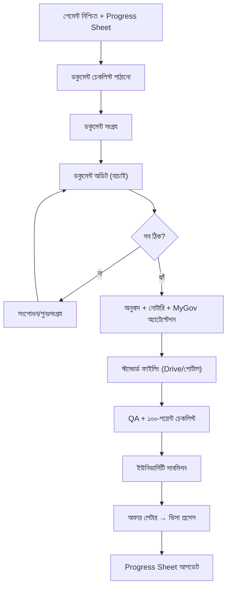

# অধ্যায় ৩: অ্যাডমিশন ওয়ার্কফ্লো

## ৩.১ উদ্দেশ্য

পেমেন্ট নিশ্চিত শিক্ষার্থীর ফাইল কীভাবে ডকুমেন্ট সংগ্রহ থেকে ইউনিভার্সিটি সাবমিশন ও ভিসা পর্যন্ত এগোয় — সম্পূর্ণ প্রবাহ বোঝা।

## ৩.২ সম্পূর্ণ অ্যাডমিশন ওয়ার্কফ্লো

## ৩.৩ ধাপ-সারণি

| ধাপ | দায়িত্ব | আউটপুট |
|---|---|---|
| চেকলিস্ট পাঠানো | কনসালটেন্ট/অডিট | প্রোগ্রাম-নির্দিষ্ট তালিকা |
| সংগ্রহ | অডিট টিম | সব ডকুমেন্ট প্রাপ্ত |
| অডিট | অডিট অফিসার | যাচাইকৃত ফাইল |
| অনুবাদ/নোটারি/অ্যাটেস্টেশন | অডিট + বহিরাগত সেবা | আইনসিদ্ধ কপি |
| ফাইলিং | অডিট টিম | Drive/পোর্টাল সংগঠিত |
| QA | সিনিয়র/ম্যানেজার | ১০০-পয়েন্ট পাস |
| সাবমিশন | অডিট + ম্যানেজার | আবেদন জমা |

## ৩.৪ চেকলিস্ট

- [ ] শিক্ষার্থী পেমেন্ট-নিশ্চিত
- [ ] প্রোগ্রাম-নির্দিষ্ট চেকলিস্ট পাঠানো
- [ ] সব ডকুমেন্ট সংগৃহীত ও অডিটেড
- [ ] অনুবাদ/নোটারি/অ্যাটেস্টেশন সম্পন্ন
- [ ] ফাইলিং স্ট্যান্ডার্ড অনুযায়ী
- [ ] QA পাস → সাবমিশন

## ৩.৫ সাধারণ ভুল / বেস্ট প্র্যাকটিস

- **ভুল:** ⛔ অডিট ছাড়াই সাবমিশন; ⛔ ধাপ এড়িয়ে যাওয়া।
- **বেস্ট প্র্যাকটিস:** ✅ প্রতিটি ধাপ Progress Sheet-এ ট্র্যাক; ✅ QA ছাড়া কখনো সাবমিট নয়।

## ৩.৬ এসকালেশন / FAQ / অনুশীলন / ম্যানেজার চেকলিস্ট

- **এসকালেশন:** ডকুমেন্ট ঘাটতি/জটিলতা → ম্যানেজার।
- **FAQ:** "শিক্ষার্থী ডকুমেন্ট দিতে দেরি করলে?" → ফলো-আপ + টাইমলাইন সেট।
- **অনুশীলন:** একটি নমুনা শিক্ষার্থীর সম্পূর্ণ ওয়ার্কফ্লো এঁকে দেখান।
- **ম্যানেজার চেকলিস্ট:** [ ] প্রতিটি ফাইল ধাপ অনুসরণ করছে? [ ] QA পাস ছাড়া সাবমিশন নেই?

\newpage
