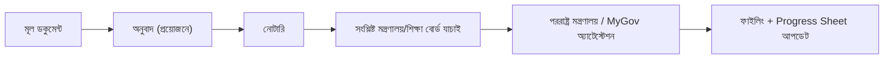

# অধ্যায় ২১: MyGov অ্যাটেস্টেশন SOP

## ২১.১ উদ্দেশ্য
প্রয়োজনীয় ডকুমেন্ট সরকারি (MyGov/সংশ্লিষ্ট মন্ত্রণালয়) অ্যাটেস্টেশনের মাধ্যমে যাচাই করানো, যা ইউনিভার্সিটি/দূতাবাসের জন্য প্রায়ই আবশ্যক।

## ২১.২ সাধারণ অ্যাটেস্টেশন ধাপ (Chain)

## ২১.৩ MyGov অ্যাটেস্টেশন ধাপ
1. MyGov/অনলাইন পোর্টালে আবেদন তৈরি করুন।
2. প্রয়োজনীয় ডকুমেন্ট আপলোড ও ফি পরিশোধ (যদি প্রযোজ্য)।
3. অ্যাপয়েন্টমেন্ট/জমার নির্দেশনা অনুসরণ করুন।
4. অ্যাটেস্টেড ডকুমেন্ট সংগ্রহ করুন।
5. স্ক্যান করে ফাইল ও Progress Sheet আপডেট।

[PLACEHOLDER - MyGov Portal Screenshot]

## ২১.৪ যাচাই মানদণ্ড
| যাচাই | নিশ্চিত করুন |
|---|---|
| অ্যাটেস্টেশন সিল/স্ট্যাম্প | স্পষ্ট |
| সঠিক ক্রম | অনুবাদ→নোটারি→অ্যাটেস্টেশন |
| ডকুমেন্ট সম্পূর্ণ | সব পাতা |
| রেফারেন্স নম্বর | সংরক্ষিত |

## ২১.৫ Red Flags / সাধারণ রিজেকশন
- ⚠️ ভুল ক্রম (অ্যাটেস্টেশনের পর অনুবাদ)।
- ⚠️ প্রয়োজনীয় অ্যাটেস্টেশন বাদ।
- ⚠️ সিল অস্পষ্ট।

## ২১.৬ চেকলিস্ট ও বেস্ট প্র্যাকটিস
- [ ] সঠিক ক্রম অনুসরণ
- [ ] সব প্রয়োজনীয় ডকুমেন্ট অ্যাটেস্টেড
- [ ] রেফারেন্স/রসিদ সংরক্ষণ
- [ ] Progress Sheet আপডেট
- **বেস্ট প্র্যাকটিস:** ✅ ইউনিভার্সিটি/দূতাবাসের নির্দিষ্ট অ্যাটেস্টেশন প্রয়োজন আগে যাচাই করুন।

## ২১.৭ এসকালেশন / FAQ / অনুশীলন
- **এসকালেশন:** অ্যাটেস্টেশন বিলম্ব/জটিলতা → ম্যানেজার।
- **FAQ:** "কতদিন লাগে?" → প্রক্রিয়াভেদে; আগেভাগে শুরু করুন যাতে ডেডলাইন মিস না হয়।
- **অনুশীলন:** সম্পূর্ণ অ্যাটেস্টেশন চেইন ধাপে ধাপে লিখুন।

\newpage
