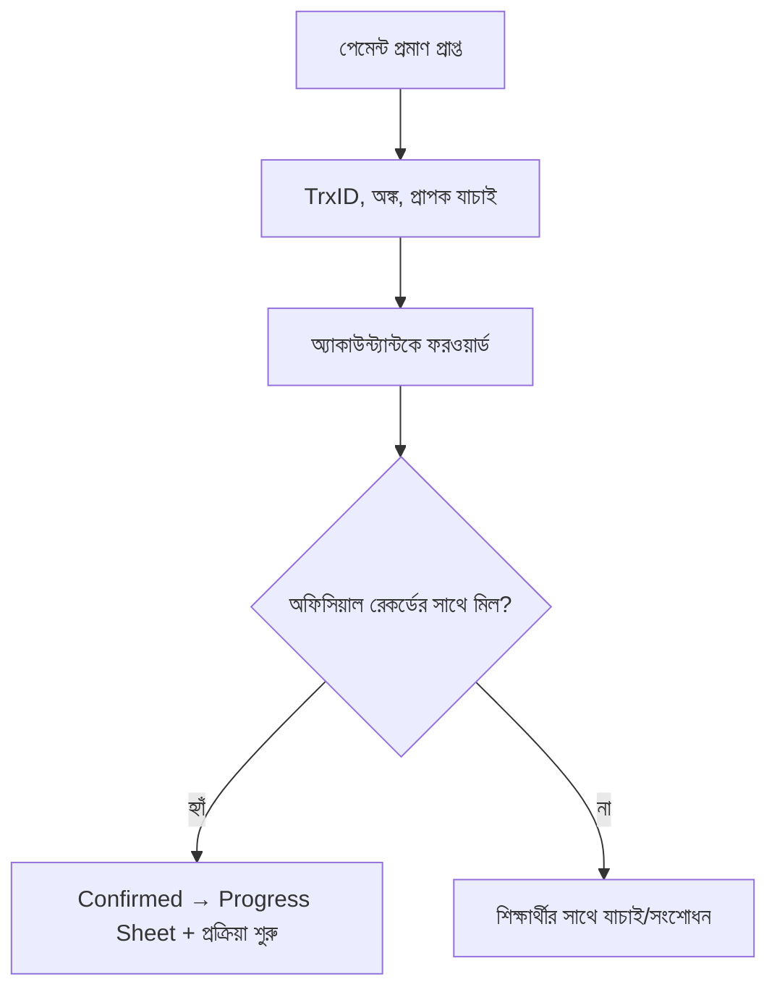

# অধ্যায় ২৭: পেমেন্ট ভেরিফিকেশন SOP

## ২৭.১ উদ্দেশ্য
Application Fee ও পরবর্তী যেকোনো পেমেন্ট নির্ভুলভাবে যাচাই করা এবং শুধুমাত্র অ্যাকাউন্ট্যান্টের নিশ্চিতকরণের পর প্রক্রিয়া এগোনো।

## ২৭.২ মূল নীতি
> 💰 **অ্যাকাউন্ট্যান্ট নিশ্চিত না করা পর্যন্ত** কোনো শিক্ষার্থীকে Progress Sheet-এ যোগ বা পরবর্তী প্রক্রিয়া শুরু করা যাবে না।
> Application Fee: **২০,০০০ BDT — নন-রিফান্ডেবল।**

## ২৭.৩ পেমেন্ট মাধ্যম ও প্রমাণ
| মাধ্যম | প্রমাণ |
|---|---|
| ক্যাশ | অফিস রসিদ |
| ব্যাংক ট্রান্সফার | ব্যাংক স্লিপ/স্ক্রিনশট |
| মোবাইল ব্যাংকিং (bKash/Nagad) | ট্রান্সঅ্যাকশন স্ক্রিনশট + TrxID |
| পোর্টাল আপলোড | আপলোড কনফার্মেশন |

[PLACEHOLDER - Payment Screenshot]

## ২৭.৪ ভেরিফিকেশন ধাপ

## ২৭.৫ Red Flags (জালিয়াতি)
- ⚠️ সম্পাদিত স্ক্রিনশট (ফন্ট/অ্যালাইনমেন্ট)।
- ⚠️ TrxID অনুপস্থিত/ডুপ্লিকেট।
- ⚠️ অঙ্ক ভিন্ন/কম।
- ⚠️ অফিসিয়াল নয় এমন প্রাপক নম্বর।

## ২৭.৬ চেকলিস্ট ও বেস্ট প্র্যাকটিস
- [ ] TrxID + অঙ্ক + তারিখ যাচাই
- [ ] অফিসিয়াল প্রাপক
- [ ] অ্যাকাউন্ট্যান্ট নিশ্চিত
- [ ] প্রমাণ Drive-এ সংরক্ষিত
- **বেস্ট প্র্যাকটিস:** ✅ কখনো ব্যক্তিগত অ্যাকাউন্টে পেমেন্ট নয়; সবসময় অফিসিয়াল চ্যানেল।

## ২৭.৭ এসকালেশন / FAQ / অনুশীলন
- **এসকালেশন:** জালিয়াতি সন্দেহ → অ্যাকাউন্ট্যান্ট + ম্যানেজার তাৎক্ষণিক।
- **FAQ:** "পেমেন্ট নিশ্চিত হতে কতক্ষণ?" → অ্যাকাউন্ট্যান্ট যাচাইয়ের পর; সাধারণত একই দিনে।
- **অনুশীলন:** একটি নমুনা bKash স্ক্রিনশটে সব যাচাই-উপাদান চিহ্নিত করুন।

\newpage
